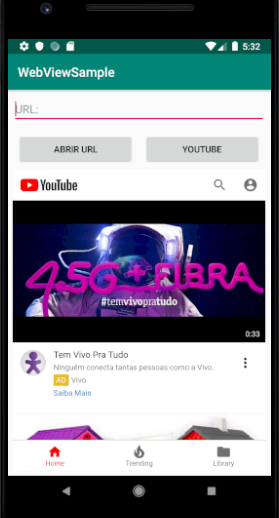

# Web View - Android App

Aplicação utilizando web view. Tela principal contendo dois botões e um campo de entrada de texto. O botão *Abrir Url* utiliza a Url fornecida pelo usuário, enquanto o botão *YouTube* redireciona o usuário ao YouTube.

## Imagens

